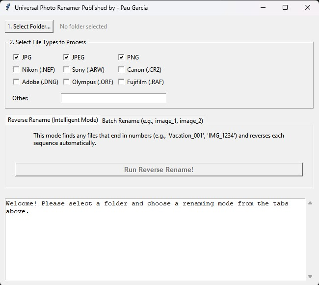

# universal-Photo-Renamer
A user-friendly desktop application built with Python and Tkinter for powerful batch and reverse-order renaming of photos and other files. This tool is perfect for photographers and anyone needing to organize large sets of files quickly.

## Key Features

-   **Dual Modes:** Choose between two powerful renaming modes in a clean, tabbed interface.
-   **User-Friendly GUI:** No command line needed. A simple and intuitive interface for everyone.
-   **Broad File Support:** Works with common formats (`.jpg`, `.png`) and a wide range of camera RAW files (`.nef`, `.arw`, `.cr2`, etc.).
-   **Custom File Types:** Easily process any file type using the "Other" field.
-   **Safe and Informative:** A log window shows exactly what's being changed, and confirmation dialogs prevent accidents.
-   **Standalone Application:** Compiled into a single `.exe` file that runs on Windows without any installation.

## Two Powerful Renaming Modes

### 1. Batch Rename
This is the workhorse mode for general file organization.
-   Renames all selected file types in a folder.
-   Creates a clean, sequential naming scheme based on a prefix you provide.
-   **Example:** `IMG_501.jpg`, `photo.nef`, `document.png` → `MyTrip_1.jpg`, `MyTrip_2.nef`, `MyTrip_3.png`

### 2. Reverse Rename (Intelligent Mode)
This is a specialized tool designed for photographers who shoot events with multiple cameras or need to reverse the order of a sequence.
-   **Automatically detects** file sequences like `DSC_1234.jpg`, `IMG_5678.nef`, or `My-Photo-99.cr2`.
-   Intelligently groups files by their common prefix (`DSC_`, `IMG_`, etc.).
-   Reverses the numerical order of each sequence *independently*.
-   **Example:** `DSC_001.jpg`, `DSC_002.jpg` → `DSC_002.jpg`, `DSC_001.jpg`

## How to Use (End Users)

1.  Go to the [Releases page](https://github.com/cpsg22/universal-Photo-Renamer/releases) on this repository.
2.  Download the latest `renamer_app.exe` file.
3.  Run the `.exe` file. No installation is needed.
    -   *Note: Windows Defender may show a warning because this is an unsigned application. Click `More info` → `Run anyway` to proceed.*

## How to Run or Compile from Source (Developers)

**1. Clone the repository:**
